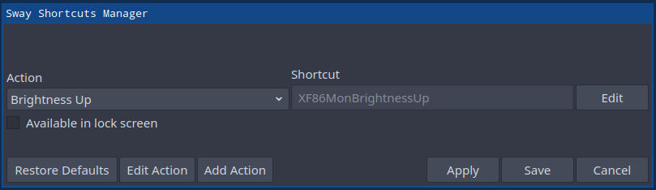
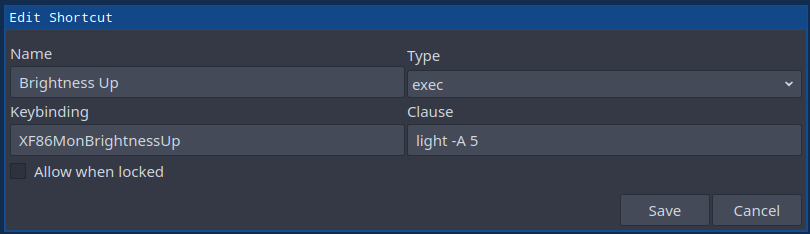

# sway_shortcuts

A shortcut manager for sway (and i3).

# Build

To build the project, first make sure you have CMake >= v3.5 and have `qt6-base` installed.

```bash
git clone https://github.com/SoumyaRanjanPatnaik/sway_shortcuts.git
cd sway_shortcuts
mkdir build && cd build
cmake ../
make
```

You can then execute the compiled binary

```
./sway_shortcuts
```

# Installation

`cd` into project root and use the following commands to install.

```bash
cd build
mkdir build && cd build
cmake ../
make install
```

The following files are created.

```
/usr/local/bin/sway_shortcuts
/etc/sway_shortcuts/default.json
```

# Usage

On opening `sway_shortcuts` for the first time, the default configs will be loaded and `~/.config/swaykbd-settings/config.json` will be created, which stores the user configurations. The ui will show a combo box with an option to select a action and view/modify its corresponding shortcuts. On applying the settings or saving, a new file `~/.config/swaykbd-settings/kbd_config` will be created which contains the generated configurations for sway (or i3).



You can click on the combo box to select the currently selected action and the keybindings for are displayed in the Shortcut field. To modify the keybinding, click on the edit button and enter the keybinding you want. To restore default keybindings, click on the `Reset Defaults` button. If the shortcut needs to be available even from lock screen, mark `Available in lock screen` as checked.

In order to add a new action or edit and action click on `Add Action` and `Edit Action`. This will open a Add/Edit Action window.


Input the relevant data and click on `Save`. The action will be modified/added to the list of actions.

To generate the config, click on the save button.

The generated sway (or i3) config for the default actions is given below

```
**** Generated By Sway Shortcuts Manager ****

bindsym XF86MonBrightnessUp exec light -A 5
bindsym --locked XF86MonBrightnessDown exec light -U 5
bindsym Super+Shift+space floating toggle
bindsym Super+space focus mode_toggle
bindsym Super+1 workspace
bindsym Super+Shift+Return exec firefox
bindsym --locked Mod4+Shift+c reload
```